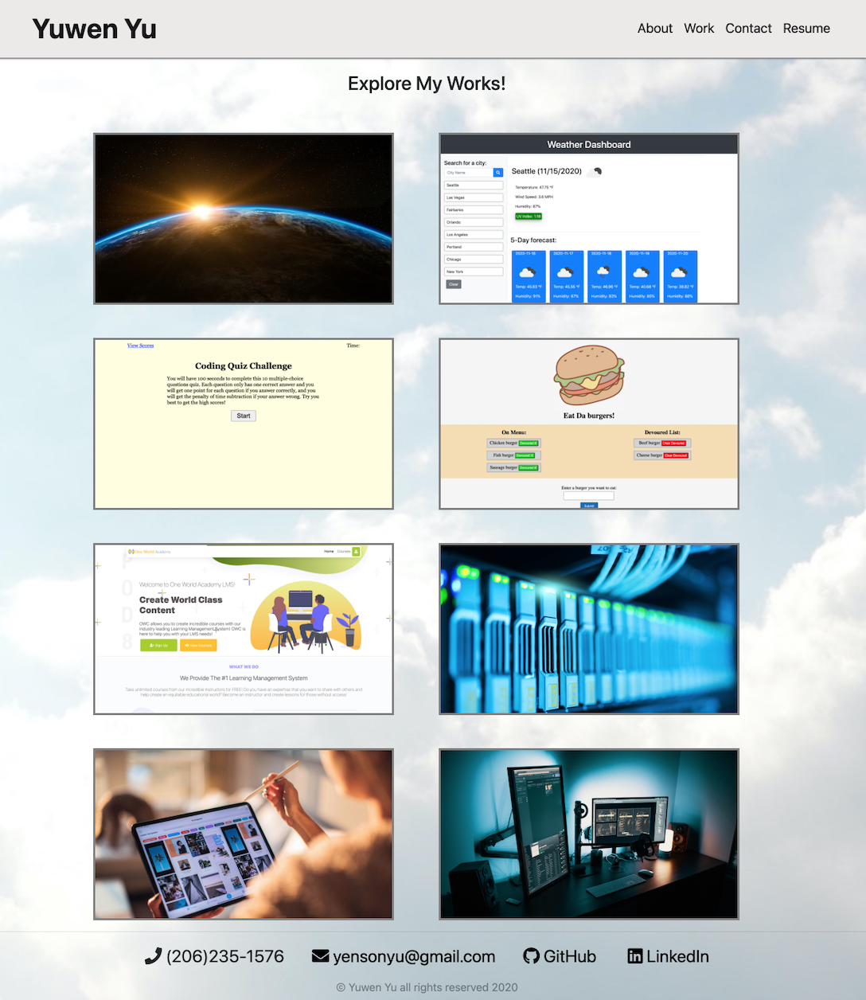

# Yuwen-Portfolio

## Task

This is a second updated version of my personral portfolio referring my work as a Full-Stack Developer. The links of some new projects has been added. The personal website of Linkedin, Github, and resume also been updated. Javascript is applied to the portfolio website so that to be more dynamic in switching different blocks of content.

## Technologies Used

* Html
* CSS
* Bootstrap
* Javascript

## Appearance

Desktop appearance:

## URL sources
Feel free to check the web application: [https://ywen26.github.io/Yuwen-Portfolio/](https://ywen26.github.io/Yuwen-Portfolio/)

And github repository: [https://github.com/ywen26/Yuwen-Portfolio](https://github.com/ywen26/Yuwen-Portfolio)

## Credits

Image sources: [https://www.pexels.com/](https://www.pexels.com/)

## License
MIT License

Copyright (c) [2021] [Ywuen Yu]

Permission is hereby granted, free of charge, to any person obtaining a copy of this software and associated documentation files (the "Software"), to deal in the Software without restriction, including without limitation the rights to use, copy, modify, merge, publish, distribute, sublicense, and/or sell copies of the Software, and to permit persons to whom the Software is furnished to do so, subject to the following conditions:

The above copyright notice and this permission notice shall be included in all copies or substantial portions of the Software.

THE SOFTWARE IS PROVIDED "AS IS", WITHOUT WARRANTY OF ANY KIND, EXPRESS OR IMPLIED, INCLUDING BUT NOT LIMITED TO THE WARRANTIES OF MERCHANTABILITY, FITNESS FOR A PARTICULAR PURPOSE AND NONINFRINGEMENT. IN NO EVENT SHALL THE AUTHORS OR COPYRIGHT HOLDERS BE LIABLE FOR ANY CLAIM, DAMAGES OR OTHER LIABILITY, WHETHER IN AN ACTION OF CONTRACT, TORT OR OTHERWISE, ARISING FROM, OUT OF OR IN CONNECTION WITH THE SOFTWARE OR THE USE OR OTHER DEALINGS IN THE SOFTWARE.

